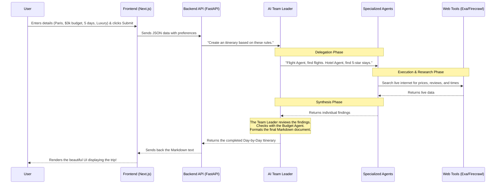

# Understanding Your Multi-Agent Travel Planning System

Welcome! If you are new to the concept of **Agentic AI** or just want to understand exactly how your application works under the hood, you are in the right place. This document breaks down the concepts, the modules, and the flow of data in plain English.

---

## 🤖 1. What is "Agentic AI"?

Normally, when you use an AI like ChatGPT, you ask a question, it generates an answer based on its training data, and it stops. It relies entirely on you to guide it.

**Agentic AI** means the AI has *agency* (the ability to act independently). 
Instead of just answering a question, an AI Agent is given a **Goal** and a set of **Tools** (like the ability to search the web, read a database, or use a calculator). It can think, plan, and execute multiple steps on its own to achieve that goal.

**What is a "Multi-Agent System"?**
Imagine a human company. You have a CEO, an Accountant, a Travel Booker, and a Tour Guide. They all talk to each other to plan a company retreat. 
Your project uses this exact concept, but with AI! Instead of one massive AI trying to do everything, you have a **team of specialized AI Agents** that collaborate to build a travel itinerary.

---

## 🧱 2. Module-by-Module Breakdown

Your project is divided into two main pieces: the **Frontend (Client)** and the **Backend (Server)**. 

### A. The Frontend Module (`client/`)
This is what the user sees and interacts with in their browser. It is built with **Next.js** and **React**.
* **The User Interface (UI):** Contains the forms where users input their destination, dates, budget, and travel style.
* **The State Manager:** Collects all the user's inputs and packages them into a single request.
* **The Renderer:** Once the AI finishes planning, this module takes the raw markdown text generated by the AI and renders it beautifully on the screen so the user can read it easily.

### B. The Backend API Module (`backend/api/` & `backend/main.py`)
This is the bridge between the user's browser and the AI brain. It is built with **FastAPI** (Python).
* **The Receiver:** It listens for incoming requests from the frontend.
* **The Coordinator:** It takes the user's preferences and passes them to the AI Team.

### C. The Agentic AI Module (`backend/agents/`)
This is the true "brain" of your application. Built using the **Agno** framework, it consists of a "Team" of agents:
1. **The Team Leader (`team.py`):** The orchestrator. It looks at the user's request and delegates tasks to the specific agents below.
2. **Flight Agent:** Focuses strictly on finding optimal flight routes and times.
3. **Hotel Agent:** Focuses strictly on finding accommodations that match the user's budget and vibe.
4. **Dining Agent:** Hunts down restaurants, checking cuisines and price ranges.
5. **Destination/Activity Agent:** Researches tourist spots, hidden gems, and museum hours.
6. **Budget Agent:** Acts as the accountant, making sure the combined choices of the other agents don't exceed the user's maximum budget limit.
7. **Itinerary Specialist:** Takes all the research from the other agents and formats it into a logical, day-by-day, hour-by-hour schedule.

### D. The Tools Module (`backend/tools/`)
AI models can't naturally browse the live internet. This module provides them with "hands and eyes."
* **Exa:** A tool that allows agents to perform smart, semantic Google-like searches.
* **Firecrawl:** A tool that allows agents to open a specific website link and read the text on the page (e.g., reading a restaurant's menu).
* **Fast-Flights:** A tool specifically for looking up live airline ticket prices.

---

## 🔄 3. The Flow of the Application

Here is exactly what happens from the moment a user clicks "Plan My Trip" to the moment the itinerary appears.

## 🌟 Why is this architecture powerful?
If you just asked a standard LLM to "plan a trip to Paris," it might hallucinate closed restaurants or give generic advice. By using **Agentic AI** with specialized roles and live web tools, your application creates a highly accurate, customized, and logically sound travel plan that respects real-world constraints like budgets and travel distances.
